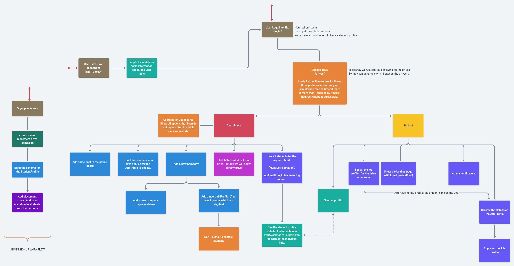
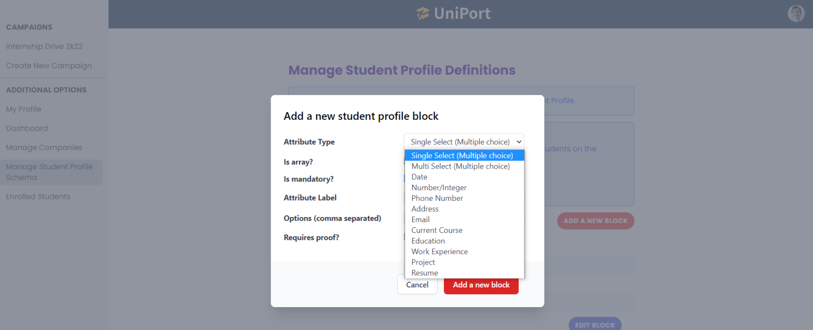

# Uniport
Uniport is a fully customizable university portal to manage the campus recruitments seamlessly. It's a software as a service and is built with multi-tenant architecture isolated at application level.

## Problem
Managing campus recruitment is challenging. At the peak of campus recruitment season, more than 50 companies visit the campus in a single day. Managing it is becoming increasingly complex with a growing number of students in a single batch and more companies visiting the campus.

## Features
* Uniport allows universities to manage their campus placements seamlessly by digitizing and automating the workflow.
* It offers complete customizability to the university admins, and they can store whatever data they want and can enforce filtering based on rules.
* Uniport offers granular access and allows admins to ensure complete authenticity, and verified data is sent to the company.

## Tech Stack
Uniport is built using the following technologies. All of them are written in typescript.
1. Next.js
2. GraphQL
3. Node.js
4. Apache Cassandra

## Modules
The code sample contains the following four modules:
* [Database](./database/): Contains the Apache-Cassandra data model
* [Frontend](./packages/frontend/): Contains a NextJS-application
* [Backend](./packages/backend/):  Contains an express-apollo GraphQL-server
* [Shared](./packages/common/):  Contains the common validators, LEGOs definitions etc which are used by both frontend and backend modules

## Application Workflow

## Currently supported LEGOs
Uniport is a modular application where the admin has power to customize the platform to their needs. For now the application supports the following types(refer image below). They cover most of the cases and can be modified by the admin based on their needs. Each of the LEGO is capable of handling multiple cases. For example: **Single Select** can be used for **Gender**, **Country**, **any objective question**.

> 💡 If you have some cases that cannot be modelled using the existing LEGOs, please do share them with us by [creating an issue](https://github.com/subhamX/uniport/issues). We shall add that soon.

> Note that LEGOs like **Education**, **Work Experience** have multiple elements nested inside. And the data corresponding to these LEGOs isn't stored using the unscalable entity attribute value model. Instead, it is modelled in an intelligent way using the Apache Cassandra collections and UDTs. ⚡⚡

