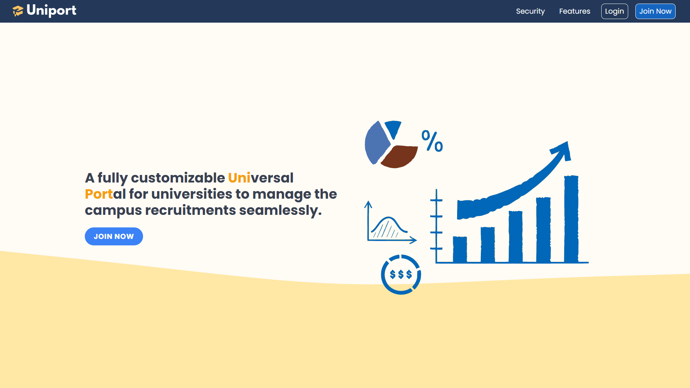

# Uniport
Uniport is a fully customizable Universal Portal for universities to manage the campus recruitments seamlessly.

## Problem

Managing campus recruitment is challenging. At the peak of campus recruitment season, more than 50 companies visit the campus in a single day. Managing it is becoming increasingly complex with a growing number of students in a single batch and more companies visiting the campus.

## Features
Uniport allows universities to manage their campus placements seamlessly by digitizing and automating the workflow.

It offers complete customizability to the university admins, and they can store whatever data they want and can enforce filtering based on rules.

Uniport offers granular access and allows admins to ensure complete authenticity, and verified data is sent to the company.

